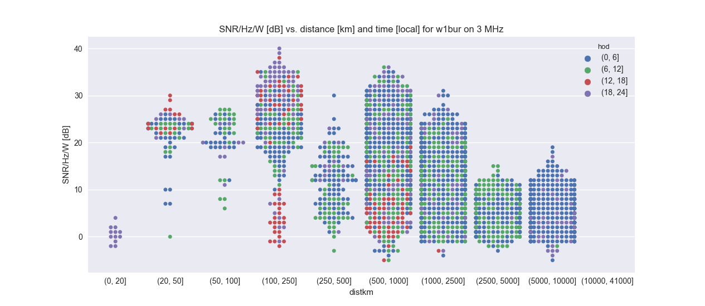
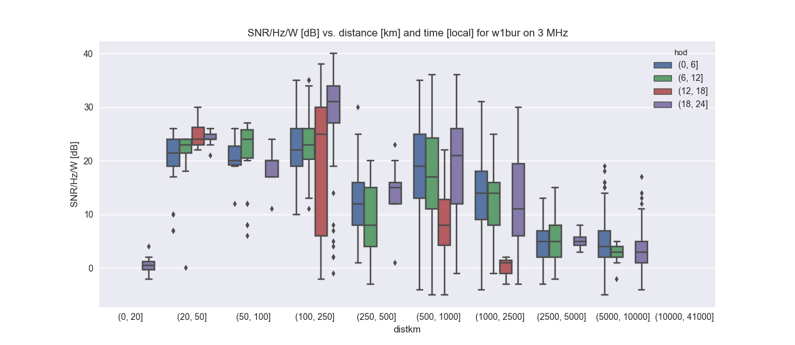

# Weak Signal Plots

WSPR, JT65, JT9 and other weak signal modes: read, analyze, plot data.
Minimalistic. 
Right now, the emphasis is on expressing expected ranges of SNR/Hz/Watt, binned by range (groundwave, NVIS, DX) and local time for each frequency band (3 MHz, 5 MHz, etc.). 
This helps understand what is feasible for general NVIS communications systems referenced to narrowband weak signal modes such as WSPR.

The swarm plot gives a sense of how many samples are at a given
configuration--if the maximum width is reached, then you know there are
at least N measurements for that result.

The box plot give the traditional sense of distribution of
variables--here also versus dawn/morning/afternoon/dusk and distance
bins.

* MaxSig: plots maximum signal on a frequency vs. distance \"What\'s the strongest I\'m heard at a distance and frequency?\"
* MapSig: plots stations and midpoint science quantities

## Install

    pip install -e .

## Data Formats

The program automatically decides based on the file extension how to decode the file.

### `.csv` format

This format is inside [each monthly WSPR log file](http://wsprnet.org/drupal/downloads).

### `.tsv` format

Copy and paste (from your web browser) a WSPRnet [database query result](http://wsprnet.org/olddb). 
Query with TX and RX callsign set to your callsign.
